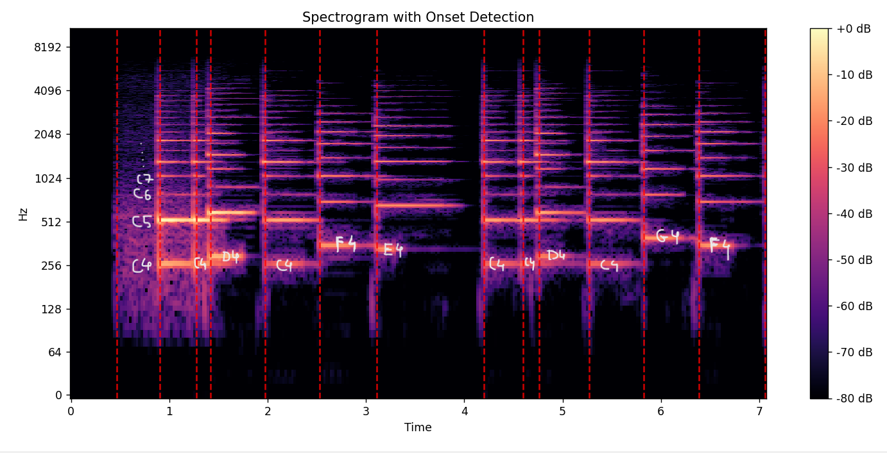

# 🎵 Music Note Detection from Audio

This project implements **automatic music note detection** from audio recordings.  
It processes an audio signal, detects **note onsets**, converts them into **frequencies**, maps them to **musical notes**, and provides both **textual output** and a **visual representation** of the waveform with detected notes.

---

## 🚀 Features

- 🎙️ Input any `.wav` audio file (monophonic preferred).
- 🥁 Onset detection to find when notes start.
- 🎼 Frequency analysis → converts detected frequencies into **musical notes**.
- 📊 Visualization → waveform with detected note positions.
- 📜 Outputs notes in sequence.

---

## Visualization of onsets:

### Finding notes in the **Happy Birthday** song (only the first 12 notes)

- Actual notes - C4 C4 D4 C4 F4 E4, C4 C4 D4 C4 G4 F4

  
  

## Output

1. Happy Birthday song- "multiple_notes/R_fast_c4-c4-d4-c4-f4-e4-c4-c4-d4-c4-g4-f4.wav"

   

---

## Polyphony (Multiple Simultaneous Notes)

### Tests on River Flows in You - Yiruma

file path = simultaneous_notes/river_flows_in_you_part1.wav

#### Actual Notes:

#### Results:

